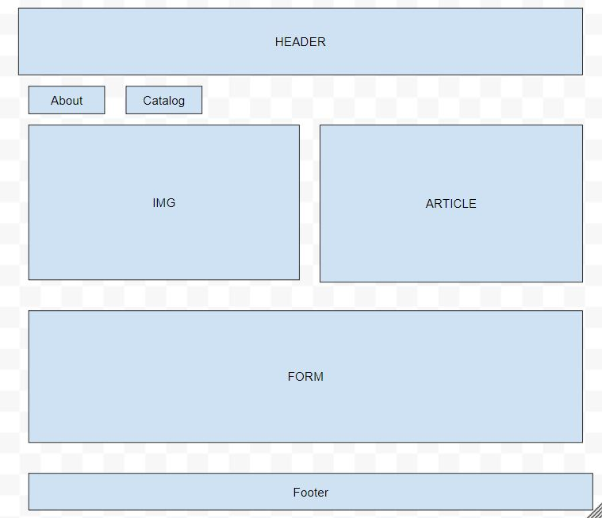
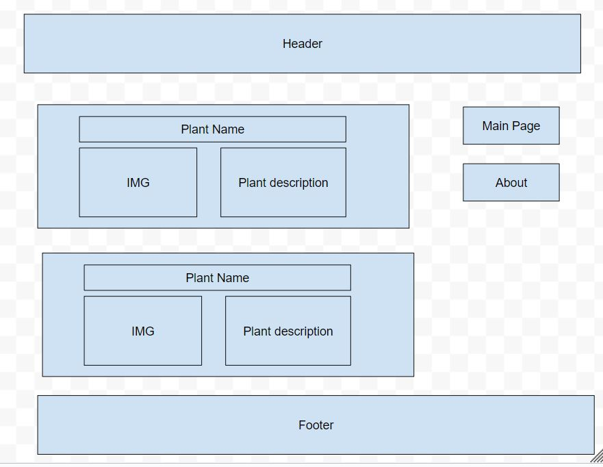
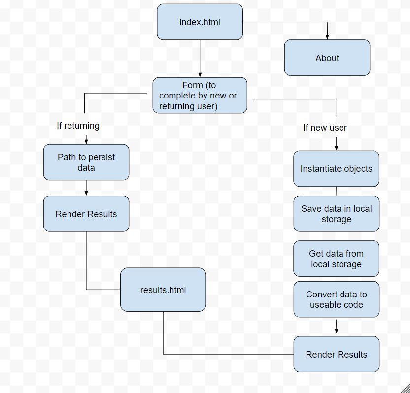

# Houseplant Website

## Summary of the project: 

This is a website that helps people to find the right houseplant that fits their needs for their home. 

## What problem or pain point does it solve? 

- When it comes to buying houseplants, there are many options in the market and it can feel overwhelming to choose the right plant. Whether the user of this website is already a plant parent or somebody who is just getting started, the site will provide recommendations taking into account their experience taking care of plants, their home environment and their level of interest. 

## Minimum Viable Product (MVP) definition.

A website with the following components:

- A main page that describes the purpose of the website, with a form where users can fill in required information so that we can know their experience with plants, their home environment and their level of interest.
- The main page will have a link to a second page that will show the houseplant recommendations.

## User Stories

1.	As a user, I want to find a plant that I can keep alive so that I can improve my wellbeing.
   
*Feature Tasks*:

-	User can complete a form to select their preferred level of maintenance.
  
*Acceptance Tests*:

-	Ensure that the user selects a plant maintenance level from the form.
-	Ensure the user is provided with a recommendation of a plant according to their needs.

2.	As a user, I want to find a plant that fits a spot in my house that is shaded so that my interior design is complete.
   
*Feature Tasks*:

-	User can complete a form to select their preferred light level.
  
*Acceptance Tests*:

-	Ensure that the user selects a plant light level from the form.
-	Ensure the user is provided with a recommendation of a plant according to their needs

3.	As a user, I want to find a plant that is cold-resistant so that it will survive in the temperatures of my home.
   
*Feature Tasks*:

-	User can complete a form and select the average temperature of their home.
  
*Acceptance Tests*:

-	Ensure that the user selects a temperature from the form
-	Ensure the user is provided with a recommendation of a plant according to their needs

4.	As a user, I want to find the right plant for me and my pet so if my pet eats it, it doesn’t die.
   
*Feature Tasks*:

-	User can complete a form to indicate if they have a pet in their home.
  
*Acceptance Tests*:

-	Ensure that the user selects an option that indicates if they have a pet in their home.
-	Ensure the user is provided with a recommendation of a plant according to their needs.

5.	As a user, I want to be able to see the plants that were suggested to me so that I can have an idea of how they will look in my home.
   
*Feature Tasks*:

-	User can access a page on the website where all the houseplant recommendations are displayed.
  
*Acceptance Tests*:
-	Ensure that the user is able to access a page on the website where all the plants that were recommended are listed.

## Website Wireframes

### Main Page

### Results Page

## Domain Model

